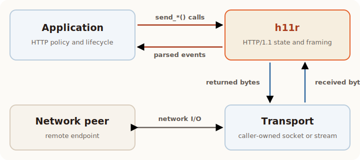

# Understand the protocol model

The [complete round trip](round-trip.md) drains events before reading more
bytes, preserves the order of outgoing bytes, and advances connection reuse
explicitly. These are the core rules behind that example.

`h11r` owns HTTP/1.1 protocol state. The surrounding program owns transport
I/O and application policy.



## Map the example to the model

The names in `round_trip.py` correspond directly to the general pieces:

| In the round-trip example | General responsibility |
| --- | --- |
| `client` and `server` | One `Connection` for each endpoint's protocol view |
| `client_socket` and `server_socket` | The caller-owned byte transport |
| `next_event()` | Drain buffered events and read only on `NEED_DATA` |
| `receive_request()` and `receive_response()` | Application handling of a complete HTTP message |
| `sendall(...)` | Caller-owned delivery of bytes returned by `h11r` |

## One connection, one endpoint

One `Connection` represents one endpoint's HTTP view of one transport
connection. Choose `Role.CLIENT` or `Role.SERVER` when constructing it.

The object tracks both the local and peer actor states. It does not own a
socket, task, timeout, or application handler.

Create independent `Connection` instances for independent transports. Separate
instances may run in parallel. Calls on one instance still have protocol order
and must be serialized by the caller.

## Receiving: bytes become events

Pass each received byte sequence to `receive_data()`, then call `next_event()`
until the connection asks you to stop.

`next_event()` returns:

- `Request`, `InformationalResponse`, or `Response` for a message head;
- zero or more `Data` events for a body;
- `EndOfMessage` for the message boundary and optional trailers;
- `ConnectionClosed` for a clean peer EOF;
- `ReceiveStatus.NEED_DATA` when another transport read is required;
- `ReceiveStatus.PAUSED` at a connection-cycle or protocol-switch boundary.

!!! important

    `NEED_DATA` and `PAUSED` are different. Reading more bytes can satisfy
    `NEED_DATA`. More bytes cannot advance `PAUSED`; finish the active cycle or
    hand the transport to the
    [selected protocol](advanced.md#protocol-handoff).

A transport read can contain part of one event or several complete messages.
Likewise, one HTTP body can produce any number of `Data` events. Use
`EndOfMessage`, not read length, to recognize completion.

When a transport read returns `b""`, pass that empty value to `receive_data()`.
The connection can then distinguish a clean close from a truncated message.

## Sending: calls return wire bytes

Sending has one ordering rule:

1. Call `send_request()`, `send_response()`, `send_data()`, or
   `end_of_message()`.
2. Write every returned byte to the transport in the same order.

The send call updates protocol state before returning. If the caller discards
or reorders returned bytes, its local state no longer describes what the peer
received.

## Connection cycles

An HTTP/1.1 keep-alive connection can carry multiple request/response cycles.
Call `start_next_cycle()` only after the request and response for the current
cycle are complete and reuse remains legal.

Pipelined bytes may already be buffered. `h11r` returns `PAUSED` until the
current response is complete, preserving request and response order. After
`start_next_cycle()`, the next buffered request becomes available.

## Errors and resource limits

`LocalProtocolError` means the caller requested an operation that is invalid
for the current state or framing.

`RemoteProtocolError` means peer input violated HTTP syntax, framing, state, or
an inbound limit. Servers can inspect `suggested_status_code` when constructing
an error response.

Each connection applies independent inbound limits:

```python
connection = h11r.Connection(
    h11r.Role.SERVER,
    max_head_bytes=64 * 1024,
    max_header_count=100,
)
```

These limits cover request or response heads and trailer sections. Application
body limits, timeouts, concurrency limits, and transport back-pressure remain
the caller's responsibility.

With those ownership and ordering rules in place, continue to
[Build a transport adapter](integration.md) and apply them to an existing
synchronous or asynchronous byte stream.
