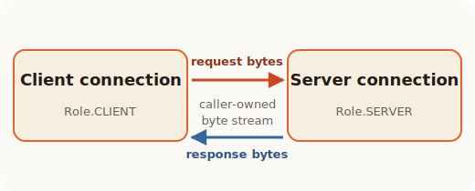

# Run a client/server round trip

The [first client request](getting-started.md) followed one client-role
`Connection`: it created a `GET` request, then parsed a fixed response byte
string.

This tutorial replaces that fixed response with the other half of the
exchange. A server-role `Connection` receives a `POST /echo` request through a
real local byte stream and sends the request body back in its response. Both
endpoints then prepare the connection for another request.

## Get and run the example

Continue in the `h11r-tour` project from the first lesson. Download the complete
example, inspect it, and then run it:

```console
curl --fail --location \
  https://raw.githubusercontent.com/cnzakii/h11r/{{ git.commit }}/examples/python/round_trip.py \
  --output round_trip.py
uv run python round_trip.py
```

If you opened this page first, complete
[Create a small project](getting-started.md#create-a-small-project) before
running those commands. If `curl` is unavailable, save
[`round_trip.py` from the repository ↗](https://github.com/cnzakii/h11r/blob/{{ git.commit }}/examples/python/round_trip.py)
in that project.

Expected output:

```text
server received POST /echo
client received 200 with b'ping'
connection is ready for another request
```

The program uses `socket.socketpair()` to create two connected sockets inside
one process. It does not open a port or contact an external server. This keeps
the entire client/request/server/response path in one file while still moving
bytes through a real transport.

Open `round_trip.py` and follow its six stages below.

## Follow the program in execution order

### 1. Create the transport and both endpoint views

`socketpair()` returns two connected sockets. Bytes written to
`client_socket` are read from `server_socket`, and vice versa:

```python
client_socket, server_socket = socket.socketpair()

client = h11r.Connection(h11r.Role.CLIENT)
server = h11r.Connection(h11r.Role.SERVER)
```

The two `Connection` objects do not share protocol state. Each tracks the same
HTTP exchange from its own endpoint's point of view.



### 2. The client sends a request

The client serializes the request head, body, and message boundary. The caller
writes every returned value to its socket in the same order:

```python
client_socket.sendall(
    client.send_request(
        "POST",
        "/echo",
        [("Host", "example.test"), ("Content-Length", "4")],
    )
)
client_socket.sendall(client.send_data(b"ping"))
client_socket.sendall(client.end_of_message())
```

`h11r` changes the client protocol state and returns bytes. `sendall()` is the
application's transport operation; it is not performed inside `h11r`.

### 3. The server receives events

The example's `next_event()` helper always asks `h11r` for an event before
reading the socket:

```python
event = connection.next_event()

if event is h11r.ReceiveStatus.NEED_DATA:
    connection.receive_data(transport.recv(64 * 1024))
```

Why this order? A previous `recv()` may have supplied several HTTP events. The
server reads again only when `NEED_DATA` says that no complete event is already
buffered.

`receive_request()` repeats that operation until it sees:

1. a `Request` containing `POST` and `/echo`;
2. one or more `Data` events containing the body;
3. `EndOfMessage`, which marks the request boundary.

Unlike the complete response byte string in the first lesson, a real transport
may split a message across any number of reads and `Data` events. The example
collects the request-body fragments into `request_body`.

### 4. The server sends the response

The server application chooses to echo `request_body`. Its server-role
connection serializes the response, and the caller writes each result to
`server_socket`:

```python
server_socket.sendall(
    server.send_response(
        200,
        [("Content-Length", str(len(request_body)))],
        reason="OK",
    )
)
server_socket.sendall(server.send_data(request_body))
server_socket.sendall(server.end_of_message())
```

Those bytes cross the same socket pair in the opposite direction.

### 5. The client receives the response

`receive_response()` follows the same receive pattern on the client endpoint.
It drains a final `Response`, any `Data` events, and `EndOfMessage`:

```python
response, response_body = receive_response(client, client_socket)
print(f"client received {response.status_code} with {response_body!r}")
```

The client therefore sees status `200` and the echoed body `b"ping"`.

### 6. Both endpoints prepare for reuse

The request and response are now complete in both endpoint state machines.
Each can explicitly begin the next HTTP/1.1 keep-alive cycle:

```python
client.start_next_cycle()
server.start_next_cycle()
```

Both connections return to `State.IDLE`; the sockets remain open.

## Make one change

In `round_trip.py`, change the request body from `b"ping"` to `b"hello"` and
its `Content-Length` from `4` to `5`. Run the example again.

The response line now ends with:

```text
client received 200 with b'hello'
```

You have now followed both sides of a complete HTTP interaction over a real
byte stream. Next, read [Core concepts](concepts.md) to give names and rules to
the behavior you just exercised.
